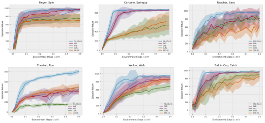

# k-Step Latent (KSL)
Implementation of k-Step Latent (KSL) in PyTorch. 

**Representation Learning for Data-Efficient Reinforcement Learning**

[[Paper]](https://arxiv.org/abs/2110.04935)

## Citation
If you use this repo in your research, please consider citing the paper as follows
```
@misc{mcinroe2021learning,
      title={Learning Temporally-Consistent Representations for Data-Efficient Reinforcement Learning}, 
      author={Trevor McInroe and Lukas Schäfer and Stefano V. Albrecht},
      year={2021},
      eprint={2110.04935},
      archivePrefix={arXiv},
      primaryClass={cs.LG}
}
```





Code is built on top of  the [DrQ](https://github.com/denisyarats/drq) repo from Denis Yarats.


## Getting Started
First, create and activate conda env:

```
conda env create -f conda_env.yml

conda activate ksl
```

This repo relies on environments from [DMControl](https://github.com/deepmind/dm_control), and therefore assumes that you can run [MuJoCo](http://mujoco.org/).

From within  `./ksl`, simply run:
```
python train.py agent=ksl.<AGENT-TYPE>
```

where ```<AGENT-TYPE>``` is in ```[KSLAgent, DrQAgent, RADAgent]```.

Altering training schemes can be done by feeding additional args, such as:
```
python train.py action_repeat=8
```
For a full list of customizable args, see `./ksl/configs.yaml`.


## Observing Runs
Just as in the DrQ repo, `train.py` will produce the `runs` folder, where all the outputs are going to be stored including train/eval logs, tensorboard blobs, and evaluation episode videos. To launch tensorboard run
```
tensorboard --logdir runs
```

The console output is also available in a form:
```
| train | E: 5 | S: 5000 | R: 11.4359 | D: 66.8 s | BR: 0.0581 | ALOSS: -1.0640 | CLOSS: 0.0996 | TLOSS: -23.1683 | TVAL: 0.0945 | AENT: 3.8132
```
a training entry decodes as
```
train - training episode
E - total number of episodes
S - total number of environment steps
R - episode return
D - duration in seconds
BR - average reward of a sampled batch
ALOSS - average loss of the actor
CLOSS - average loss of the critic
TLOSS - average loss of the temperature parameter
TVAL - the value of temperature
AENT - the actor's entropy
```
while an evaluation entry
```
| eval  | E: 20 | S: 20000 | R: 10.9356
```
contains
```
E - evaluation was performed after E episodes
S - evaluation was performed after S environment steps
R - average episode return computed over `num_eval_episodes` (usually 10)
```
